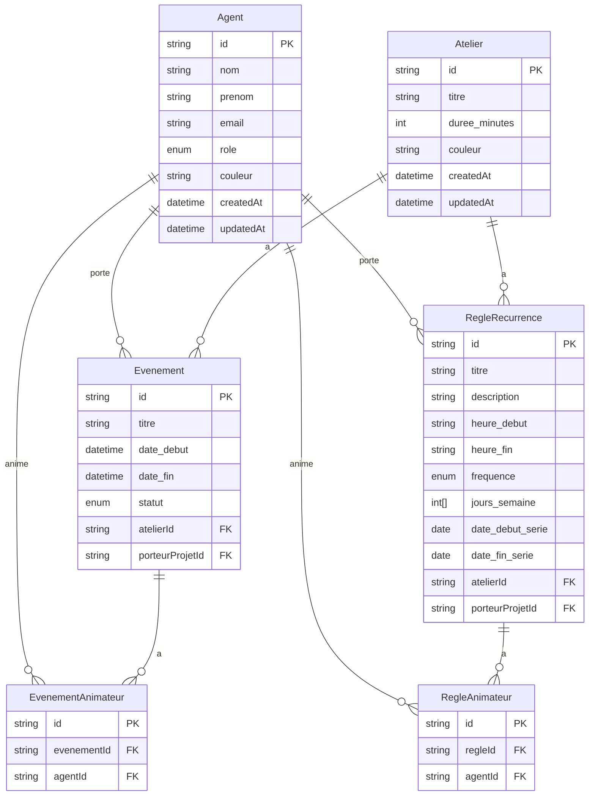
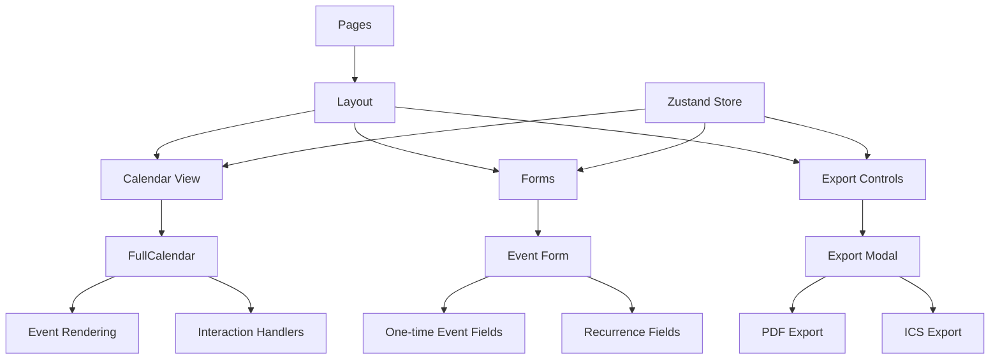

# Implementation Plan: Application de Planning EPN

## Project Overview

This document outlines the implementation plan for developing an application to manage workshops (ateliers) for an EPN (Espace Public Numérique). The application will handle both one-time and recurring events, with export capabilities to PDF and ICS formats.

## Technical Stack

- **Frontend**: Next.js with TypeScript, Tailwind CSS
- **State Management**: Zustand
- **Form Handling**: React Hook Form with Zod validation
- **UI Components**: Radix UI, Lucide React icons
- **Calendar**: FullCalendar with recurrence support
- **PDF Generation**: @react-pdf/renderer
- **Database**: 
  - Development: SQLite (for simplicity)
  - Production: PostgreSQL (as specified in requirements)
- **ORM**: Prisma

## Implementation Timeline

The project will be implemented over a 4-week period:

| Week | Focus | Key Deliverables |
|------|-------|------------------|
| 1 | Project Setup & Database | Project structure, database schema, initial API routes |
| 2 | Core Backend & Basic Frontend | Complete API implementation, basic UI components, calendar integration |
| 3 | Frontend Forms & State Management | Event forms, recurrence handling, state management |
| 4 | Export Functionality & Testing | PDF/ICS export, testing, refinement, deployment |

## Detailed Implementation Plan

### Week 1: Project Setup & Database

#### Day 1-2: Project Initialization

1. **Create Next.js Project**
   ```bash
   npx create-next-app@latest gestion_ateliers_epn_nextjs --typescript --tailwind --eslint
   cd gestion_ateliers_epn_nextjs
   ```

2. **Install Dependencies**
   ```bash
   # Core + Récurrence
   npm install @prisma/client @fullcalendar/react @fullcalendar/daygrid @fullcalendar/timegrid @fullcalendar/interaction @fullcalendar/rrule
   # Forms & Validation
   npm install zustand zod react-hook-form @hookform/resolvers
   # UI, Utils & Export
   npm install @radix-ui/react-dialog @radix-ui/react-select @radix-ui/react-checkbox @radix-ui/react-label
   npm install lucide-react date-fns sonner clsx tailwind-merge class-variance-authority
   npm install @react-pdf/renderer
   # Dev
   npm install -D prisma
   ```

3. **Project Structure Setup**
   - Create folder structure:
     ```
     /src
       /app
         /api
         /pages
       /components
         /ui
         /calendar
         /forms
         /pdf
       /lib
       /styles
     ```

#### Day 3-4: Database Configuration

1. **Initialize Prisma**
   ```bash
   npx prisma init
   ```

2. **Configure Database**
   - For development: Update `.env` with SQLite connection string
     ```
     DATABASE_URL="file:./dev.db"
     ```
   - For production: Prepare PostgreSQL connection string template

3. **Implement Database Schema**
   - Create the schema as specified in the requirements
   - Implement the models: Agent, Atelier, Evenement, RegleRecurrence, and pivot tables

4. **Run Migrations**
   ```bash
   npx prisma migrate dev --name init
   npx prisma generate
   ```

5. **Create Seed Data**
   - Implement a seed script to populate the database with initial data
   - Include sample agents, workshops, and events

#### Day 5: Initial API Routes

1. **Create Database Client**
   - Set up Prisma client in `/src/lib/prisma.ts`

2. **Implement Basic API Routes**
   - Create API routes for CRUD operations on Agents and Ateliers
   - Implement error handling and response formatting

### Week 2: Core Backend & Basic Frontend

#### Day 1-2: Complete API Implementation

1. **Implement Validation Schemas**
   - Create Zod validation schemas for events and recurrence rules
   - Implement type definitions based on the Prisma schema

2. **Develop Event API Routes**
   - Implement the API for fetching events with recurrence expansion
   - Create endpoints for one-time events and recurring events

3. **Implement Recurrence Logic**
   - Develop the logic to expand recurring events based on rules
   - Use RRule library to handle recurrence patterns

#### Day 3-5: Basic Frontend & Calendar Integration

1. **Create UI Components**
   - Implement reusable UI components (buttons, inputs, modals)
   - Create layout components and navigation

2. **Set Up Calendar Component**
   - Integrate FullCalendar
   - Implement event fetching and rendering
   - Handle basic interactions (click, view change)

3. **Create Basic Dashboard**
   - Implement a dashboard page with calendar view
   - Add navigation between different views (day, week, month)

### Week 3: Frontend Forms & State Management

#### Day 1-2: Event Forms

1. **Create Event Form Components**
   - Implement form for one-time events
   - Create form for recurring events with frequency options
   - Add validation using Zod schemas

2. **Implement Form Toggle**
   - Add functionality to toggle between one-time and recurring event forms
   - Ensure proper validation for each form type

#### Day 3-4: State Management

1. **Set Up Zustand Store**
   - Create stores for managing application state
   - Implement state for events, forms, and UI

2. **Connect Forms to API**
   - Implement form submission logic
   - Handle API responses and error states
   - Add loading states and user feedback

#### Day 5: UI Refinement

1. **Improve Calendar Display**
   - Enhance event rendering with colors and details
   - Implement tooltips and event details modal

2. **Add Filtering Options**
   - Create filters for viewing events by workshop type or agent
   - Implement search functionality

### Week 4: Export Functionality & Testing

#### Day 1-2: Export Implementation

1. **Create PDF Template**
   - Implement PDF layout using @react-pdf/renderer
   - Create components for rendering events in PDF format

2. **Develop ICS Export**
   - Implement ICS file generation logic
   - Ensure compatibility with standard calendar applications

3. **Create Export UI**
   - Add export buttons to the calendar view
   - Implement export options modal (date range, format)

#### Day 3-4: Testing & Refinement

1. **Comprehensive Testing**
   - Test event creation (one-time and recurring)
   - Verify calendar display and interactions
   - Test export functionality
   - Validate form behavior and error handling

2. **UI/UX Refinement**
   - Improve responsive design
   - Enhance accessibility
   - Optimize performance

#### Day 5: Deployment Preparation

1. **Environment Configuration**
   - Set up environment variables for production
   - Configure database connection for production

2. **Build & Deployment**
   - Create build scripts
   - Document deployment process
   - Prepare for handover

## Technical Architecture

### Database Schema



### API Structure

```mermaid
graph TD
    A[Client] --> B[Next.js API Routes]
    B --> C[Prisma ORM]
    C --> D[Database]
    
    B --> E[/api/agents]
    B --> F[/api/ateliers]
    B --> G[/api/evenements]
    B --> H[/api/evenements-uniques]
    B --> I[/api/recurrence]
    B --> J[/api/export]
    
    G --> K[Recurrence Expansion]
    J --> L[PDF Generation]
    J --> M[ICS Generation]
```

### Frontend Architecture



## Database Alternatives

While the specifications mention PostgreSQL, we recommend the following approach:

1. **Development**: Use SQLite for simplicity during development
   - Easier setup, no separate server needed
   - File-based database that can be committed to version control
   - Compatible with Prisma ORM

2. **Production**: Use PostgreSQL as specified
   - Better performance for concurrent users
   - More robust for production workloads
   - Follows the original specifications

The Prisma ORM abstracts the database interactions, making it relatively simple to switch between database providers when moving from development to production.

## Conclusion

This implementation plan provides a structured approach to developing the EPN workshop management application within the 4-week timeframe. By following this plan, we will deliver a fully functional application that meets all the requirements specified in the cahier des charges.

The plan is designed to be flexible, allowing for adjustments as needed during the development process. Regular progress reviews at the end of each week will help ensure that the project stays on track and that any issues are addressed promptly.